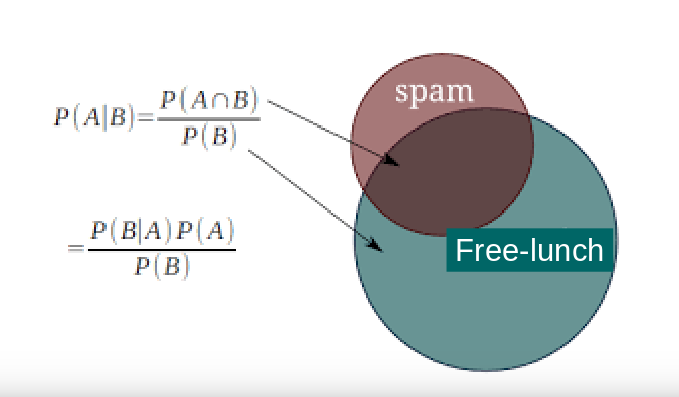

## Definitions: remiders

* $$H_0$$ : null hypothesis: The hypothesis that the effect we are testing for is null

* $$H_A$$ : alternative hypothesis : Not $$H_0$$, so there is some signal

* $$T$$ : The random variable that takes value "significant" or "not significant"

* $$T_S$$ : Value of T when test is significant (eg $$T = T_S$$)

* $$T_N$$ : Value of T when test is not significant (eg $$T = T_N$$)

* $$\alpha$$ : false positive rate - probability to reject $$H_0$$ when $$H_0$$ is true ($$H_A$$ is false) $$ = P(T_S \mid H_0) $$

* $$\beta$$ : false negative rate - probability to accept $$H_0$$ when $$H_A$$ is true ($$H_0$$ is false) $$ = P(T_N \mid H_A) $$

* power = $$W = 1-\beta$$

## PPV : definition  

PPV = $$ P(H_A \mid T_S) $$

## PPV : How do I compute it ? where does it come from ?  

### Let's do some basic probability

We consider that the hypotheses H_0 and H_A are *random*, i.e. they have associated probabilities. For instance, the probability of $$H_0$$ to be true could be 20%. We have either $$H_A$$ is true, or else $$H_0$$ is true. Therefore:

$$P(H_A = True) + P(H_0 = True) = 1$$.

We simply note

$$P(H_A = True)$$ as $$P(H_A)$$

and

$$P(T = T_S)$$ as $$P(T_S)$$  

<!-- for
$$H \in (H_A, H_0)$$
-->

We are interested in the probability of a significant test, we can write

 $$P(T_S) = P(T_S, H_A) + P(T_S, H_0)$$

because $T_S$ occurs either under the null or the alternative (mutually exclusive) and their represent all the possibilities.

## Bayes theorem

The famous [Bayes theorem](http://en.wikipedia.org/wiki/Bayes'_theorem#Derivation) states:

$$P(A, B) = P(A \mid B) P(B)$$

and therefore

$$P(A \mid B) = \frac{P(A, B)}{P(B)} = \frac{P(B \mid A) P(A)}{P(B)}$$

## Apply this to our question:

Now, apply this to the probability of the test results $$T$$.

<!-- The test takes a value either under  $$H_A$$ or $$H_0$$. -->

The probability of a *significant* result of the test $$T=T_S$$ is :

$$ P(T_S) = P(T_S, H_A) + P(T_S, H_0) $$

$$ P(T_S) = P(T_S \mid H_A) P(H_A) + P(T_S \mid H_0) P(H_0)$$

What is the probability of $$H_A$$ given that the test is significant (eg, PPV) ?

$$P(H_A \mid T_S) = \frac{P(T_S \mid H_A) P(H_A)}{P(T_S)} = \frac{P(T_S \mid H_A) P(H_A)}{P(T_S \mid H_A) Pr(H_A) + Pr(T_S \mid H_0) Pr(H_0)}$$

And we know that

$$ P(T_S \mid H_A) = 1 - P(T_N \mid H_A) = 1 - \beta  = W $$

Substituting:

$$ P(H_A \mid T_S) = \frac{W P(H_A)}{W P(H_A) + \alpha P(H_0)} $$

Defining:
$$ R = \frac{P(H_A)}{P(H_0)} $$ the odd ratio of the alternative over the null  

<!-- $$ \pi := Pr(H_A)$$, hence: $$1 - \pi = Pr(H_0) $$
Defining  $$ R = \frac{\pi}{1-\pi}

$$ P(H_A \mid T_S) = \frac{W \pi}{W \pi + \alpha (1 - \pi)} $$
and with $$ W = 1 - \beta $$ the power we get
-->

$$ P(H_A \mid T_S) = \frac{W R}{W R  + \alpha} $$

## PPV :Some exercises  

> ## Task: Play with the PPV - understand the impact of the parameters
>  
>     Pick a recent study that you have done in fMRI or using anatomical data.  
>     try to propose values for power, alpha, and prior
>     Vary power from .1 to .9 and print or plot results
>
>     First define a function to compute the PPV from power, odd ratio and alpha
>     The solution below is in Python, but feel free to do it in your favorite scripting language
>
> > ## Solution
> > ~~~
> >
> > def PPV_OR(odd_ratio, power, alpha, verbose=True):
> >     """
> >     returns PPV from odd_ratio, power and alpha
> >     
> >     parameters:
> >     -----------
> >     odd_ratio: float
> >         P(H_A)/(1-P(H_A))
> >     power: float
> >         Power for this study
> >     alpha: float
> >         type I risk of error
> >         
> >     Returns:
> >     ----------
> >     float
> >         The positive predicted value
> >     
> >     """
> >     
> >     ppv = (power*odd_ratio)/(power*odd_ratio + alpha)
> >     if verbose:
> >         print("With odd ratio=%3.2f, "
> >                "Power=%3.2f, alpha=%3.2f, "
> >                "We have PPV=%3.2f" %(odd_ratio,power,alpha,ppv))
> >     return ppv
> > ~~~
> > {: .python}
> {: .solution}
>  
>     Second define a function to display easily the results
>
> > ## Solution
> > ~~~
> > def plot_ppv(xvalues, yvalues, xlabel, ylabel, title):
> >    '''
> >    simply plot yvalues against xvalues, with labels and title
> >    
> >    Parameters:
> >    -----------
> >    xvalues, yvalues : iterables of numbers
> >    labels and title : string
> >    '''
> >    
> >    fig = plt.figure();
> >    axis = fig.add_subplot(1, 1, 1)
> >    axis.plot(xvalues, yvalues, color='red', marker='o', linestyle='dashed',
> >            linewidth=2, markersize=14);
> >    axis.set_xlabel(xlabel,fontsize=20);
> >    axis.set_ylabel(ylabel,fontsize=20);
> >    axis.set_title(figure_title, fontsize=20);
> >    return fig, axis
> > ~~~
> > {: .python}
> {: .solution}
>
>     Last play with parameters : first, let's vary power
>
> > ## Solution
> > ~~~
> >
> > #-----------------------------------------------------------------
> > # An example
> > R = 1./5.
> > Pw = .5
> > alph = .05
> > ppv = PPV_OR(R, Pw, alph)
> >
> > #-----------------------------------------------------------------
> > # Vary power:
> > Pw = np.arange(.1,1,.2)
> > ppvs = [PPV_OR(R, pw, alph, verbose = False) for pw in Pw]
> > xlabel = 'Power'
> > ylabel = 'PPV'
> > figure_title = 'With an odd ratio of {odd_ratio}'.format(odd_ratio=R)
> >
> > #-----------------------------------------------------------------
> > # print
> > plot_ppv(Pw, ppvs, xlabel, ylabel, figure_title);
> > ~~~
> > {: .python}
> {: .solution}
>
>     Then, let's vary odd ratio
>
> > ## Solution
> > ~~~
> > #-----------------------------------------------------------------
> > # Vary odd ratio:
> > Pw = .5
> > alph = .05
> > odd_ratios = np.arange(.05,.5,.05)
> > ppvs = [PPV_OR(R, Pw, alph, verbose = False) for R in odd_ratios]
> >
> > #-----------------------------------------------------------------
> > # print
> > figure_title = 'With a power of {power}'.format(power=Pw)
> > xlabel = 'odd_ratios'
> > ylabel = 'PPV'
> > plot_ppv(odd_ratios, ppvs, xlabel, ylabel, figure_title);
> >
> > ~~~
> > {: .python}
> {: .solution}
>
>     Last, let's vary alpha, remember that p-hacking may give us large type I risk of errors
>
> > ## Solution
> > ~~~
> >
> > #-----------------------------------------------------------------
> > # Vary alpha:
> > Pw = .5
> > R = 1/5
> > alphas = np.arange(0, .2, 0.01)# [0.001, .005, 0.01, 0.05, 0.1] #, 0.2, 0.3, 0.4, 0.5]
> > ppvs = [PPV_OR(R, Pw, alph, verbose = False) for alph in alphas]
> >
> > #-----------------------------------------------------------------
> > # print
> > xlabel = 'alpha'
> > ylabel = 'PPV'
> > figure_title = 'With a power of {power} and odd ratio of {odd_ratio}'.format(
> >                                         power=Pw, odd_ratio=R)
> > plot_ppv(alphas, ppvs, xlabel, ylabel, figure_title);
> > #-----------------------------------------------------------------
> > ~~~
> > {: .python}
> {: .solution}
{: .challenge}

## This is also in a python notebook
The above discussed points can also be explored within this [jupyter notebook](https://github.com/ReproNim/module-stats/blob/gh-pages/notebooks/Positive-Predictive-Value.ipynb)

### How to work with the notebooks ?

There are two cases.

1. You do not really know python, and how to install the jupyter notebook. You
   can still read the notebook, skipping the code sections. The notebook will
introduce some definitions, and then play with different settings. But the true
benefit comes if you can install the jupyter project [see
here](http://jupyter.readthedocs.io/en/latest/install.html) and actually play
with the code, for instance changing the sample size or effect size to
understand better what power is.

2. Download the notebook, and try to understand the concepts and the code. If
   the code is unclear, please make an issue on the repronim [github
site](https://github.com/ReproNim/module-stats/tree/gh-pages/notebooks).

3. Run it interactively on [binder]().

<!--
### some notes

This updated probability is $$P(H_A \mid T=t), t \in (T_S, T_N)$$,  

the probability of $$H_A$$ **given** the result $$t$$ of the test.

$$P(H_A \mid T)$$ is called the *posterior* probability because it is the probability after the test result.

The marginalization theorem is simply that

 $$P(A) = \sum_{b_i} P(A,B = b_i) $$

Here:

 $$P(H) = P(H, T=T_S) + P(H, T=T_N)$$

 $$ = \sum_{t = T_S, T_N} P(H, T=t) $$

In the future, to simplify the notation, we note $$P(B=b)$$ as $$P(b)$$

### Bayes theorem

The famous theorem [Bayes theorem](http://en.wikipedia.org/wiki/Bayes'_theorem#Derivation):

$$P(A, B) = P(A \mid B) P(B)$$

and therefore

$$P(A \mid B) = \frac{P(B, A)}{P(B)} = \frac{P(B \mid A) P(A)}{P(B)}$$

Putting these two together we have :

$$P(A) = \sum_{b_i} P(A \mid B=b_i) P(B=b_i)$$

-->
